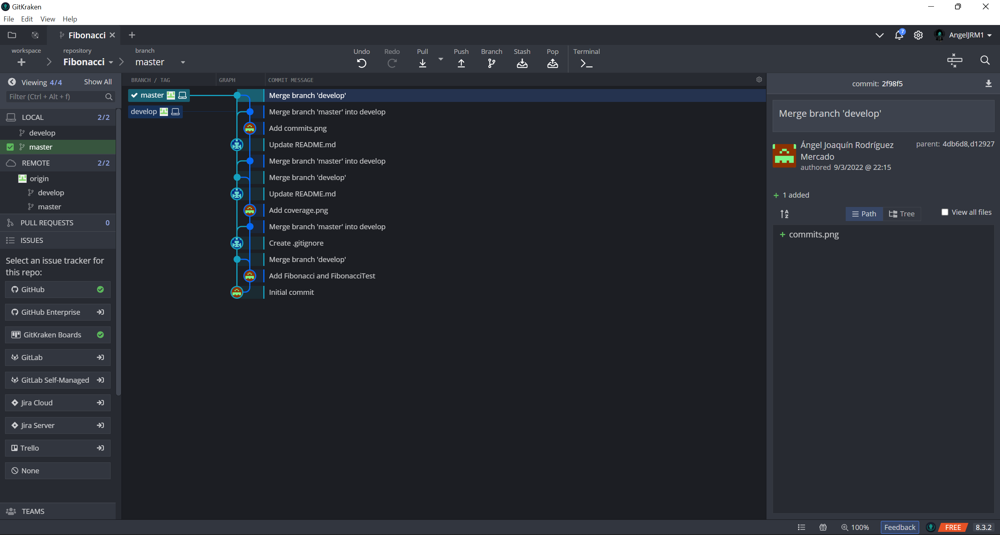

<h1>Fibonacci</h1>
Repository in which it is tested with JUnit 5 a version of computed Fibonacci sequence numbers given valid positions.
<h3>This repository provides:</h3>
<ul>
  <li>Class "Fibonacci.java", which providing a method that computes the fibonacci sequence of a given valid position.</li>
  <li>Class "FibonacciTest.java", which contains JUnit 5 test cases to test the functionality of the "compute" method in "Fibonacci.java".</li>  
</ul>
<h3>Test cases:</h3>
<ul>
  <li>Should compute return zero if the position is zero.</li>
  <li>Should compute return one if the position is one.</li>  
  <li>Should compute return one if the position is two.</li>  
  <li>Should compute return two if the position is three.</li>  
  <li>Should compute return three if the position is four.</li>  
  <li>Should compute return five if the position is five.</li>  
  <li>Should compute return eight if the position is six.</li>  
  <li>Should compute return 55 if the position is ten.</li>  
  <li>Should compute of a negative number raise an exception.</li>  
</ul>
<h3>Images</h3>
<h5>coverage.png</h5>

<h5>commits.png</h5>

